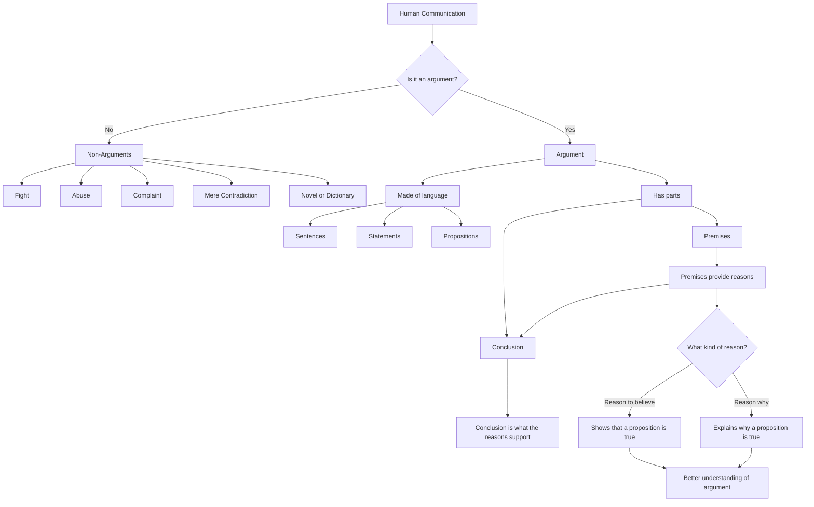
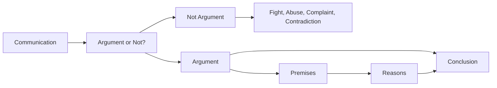

# 2. What is an Argument

## 1. Core Ideas in Order of Appearance — 9 ideas

### Idea 1: Arguments matter, but they are not everything

**Plain-English Meaning:**
Arguments are important because they help us reason well, but life is not only about arguments. Emotions, relationships, experiences, and other human concerns also matter.

**Why It Matters:**
The course is not saying that logic replaces life. It is saying that when we do reason, decide, debate, or evaluate claims, we need to understand how arguments work.

**Common Confusion:**
Thinking that because arguments matter, everything must be turned into an argument.

---

### Idea 2: To understand arguments, first distinguish them from non-arguments

**Plain-English Meaning:**
Before we can analyze arguments, we need to know what does **not** count as an argument.

**Why It Matters:**
Many things look or sound like arguments but are not actually arguments. These include fights, abuse, complaints, contradictions, stories, and dictionaries.

**Common Confusion:**
Mistaking any heated exchange for an argument.

---

### Idea 3: Arguments are not fights

**Plain-English Meaning:**
An argument, in logic, is not the same thing as a physical or verbal fight.

**Why It Matters:**
You do not win an argument by overpowering someone, yelling louder, or intimidating them.

**Common Confusion:**
In ordinary language, people often say “they were arguing” when they mean “they were fighting.”

---

### Idea 4: Arguments are not abuse

**Plain-English Meaning:**
Calling someone names or insulting them is not the same as giving reasons.

**Why It Matters:**
Abuse may be emotionally forceful, but it does not prove anything.

**Common Confusion:**
Thinking that attacking the person weakens the person’s argument.

---

### Idea 5: Arguments are not complaints

**Plain-English Meaning:**
A complaint expresses dissatisfaction, frustration, or emotion. It does not necessarily give reasons for a conclusion.

**Why It Matters:**
Complaints may reveal how someone feels, but they may not establish what anyone should believe or do.

**Common Confusion:**
Mistaking emotional expression for reasoning.

---

### Idea 6: Arguments are not mere contradiction

**Plain-English Meaning:**
Simply denying what someone says is not an argument.

**Why It Matters:**
Disagreement alone does not provide reasons.

**Example:**
One person says, “The best ice cream flavor is Coconut Almond Fudge Chip.”
Another person says, “No, it isn’t.”

That is a disagreement, not an argument.

**Common Confusion:**
Thinking that saying “no” is enough to argue against a claim.

---

### Idea 7: An argument is an intellectual process

**Plain-English Meaning:**
Arguing means giving reasons, not merely asserting, denying, insulting, or complaining.

**Why It Matters:**
The essence of argument is rational support.

**Common Confusion:**
Thinking an argument is mainly about winning. In logic, an argument is mainly about giving support for a conclusion.

---

### Idea 8: Monty Python’s definition is useful but incomplete

**Plain-English Meaning:**
Monty Python defines an argument as a connected series of statements intended to establish a proposition. This is close, but not perfect.

**Why It Matters:**
Some arguments do not establish something new. Instead, they explain why something already accepted is true.

**Example:**
A proof of the Pythagorean theorem may not convince people that the theorem is true, because they may already believe it. But it helps them understand **why** it is true.

**Common Confusion:**
Thinking all arguments are meant only to prove unknown or disputed claims.

---

### Idea 9: Arguments can give different kinds of reasons

**Plain-English Meaning:**
Arguments may give reasons to believe something is true, or reasons why something is true.

**Why It Matters:**
This distinction makes the definition of argument broader and more accurate.

**Common Confusion:**
Treating explanation and proof as exactly the same thing.

---

## 2. Definitions and Distinctions — 7 terms

### Term: Argument

**Definition:**
A connected series of sentences, statements, or propositions in which some are premises and one is a conclusion, and the premises are intended to provide some kind of reason for the conclusion.

**In My Own Words:**
An argument is a structured attempt to support a conclusion with reasons.

**Contrast With:**
A fight, insult, complaint, contradiction, novel, dictionary, or mere assertion.

**Example:**
“You should not buy that car because it is overpriced, unreliable, and more expensive to repair than similar cars.”

**Non-Example:**
“You’re an idiot if you buy that car.”

**Documented Real-World Example:**
Martin Luther King Jr.’s “Letter from Birmingham Jail” is an argument because it gives reasons for direct action and civil disobedience. King does not merely express frustration; he supports conclusions about unjust laws, moral responsibility, and why waiting for justice can itself preserve injustice. [Source: Stanford King Institute](https://okra.stanford.edu/link/document630416-041)


*Image: Recreation of King’s Birmingham Jail cell at the National Civil Rights Museum. Source: Wikimedia Commons.*

---

### Term: Premise

**Definition:**
A statement in an argument that is intended to provide support for the conclusion.

**In My Own Words:**
A premise is a reason.

**Contrast With:**
Conclusion.

**Example:**
“The car is unreliable.”

**Non-Example:**
“Therefore, you should not buy the car.”

**Documented Real-World Example:**
The 1964 Surgeon General’s report on smoking used scientific findings as premises for its public-health conclusions. Claims about lung cancer, chronic bronchitis, and mortality were not the final policy conclusion by themselves; they functioned as reasons supporting the conclusion that smoking damages health. [Source: National Library of Medicine](https://profiles.nlm.nih.gov/spotlight/nn/catalog/nlm:nlmuid-101584932X814-img)


*Image: Cover of the 1964 Surgeon General report Smoking and Health. Source: Wikimedia Commons / U.S. Public Health Service.*

---

### Term: Conclusion

**Definition:**
The statement that the premises are intended to support.

**In My Own Words:**
The conclusion is what the argument is trying to get you to believe or accept.

**Contrast With:**
Premise.

**Example:**
“Therefore, you should not buy the car.”

**Non-Example:**
“The car has poor safety ratings.”

**Documented Real-World Example:**
In *Brown v. Board of Education*, the Supreme Court’s central conclusion was that racial segregation in public schools violates equal protection. The legal reasoning supported that conclusion by examining the meaning and effects of segregated schooling. [Source: National Archives](https://www.archives.gov/exhibits/documented-rights/exhibit/section5/detail/brown-judgment-transcript.html)


*Image: Judgment document in Brown v. Board of Education. Source: National Archives / Wikimedia Commons.*

---

### Term: Contradiction / Denial

**Definition:**
In the lecture’s discussion, contradiction means simply denying what another person says.

**In My Own Words:**
It means saying “no, that’s false” without giving reasons.

**Contrast With:**
Argument.

**Example:**
Person A: “This is the best ice cream.”
Person B: “No, it isn’t.”

**Non-Example:**
“No, it isn’t the best ice cream because it is too sweet, too expensive, and has an unpleasant texture.”

**Documented Real-World Example:**
Monty Python’s “Argument Clinic” makes this distinction explicit. The customer says, “An argument isn’t just contradiction,” and defines argument as “a connected series of statements intended to establish a proposition.” The joke works because the other speaker keeps merely contradicting him. [Source: Monty Python transcript](https://mcli.cogdogblog.com/smc/ml/montypythonargument.html)

Video: [Monty Python Argument Clinic](https://www.youtube.com/watch?v=xpAvcGcEc0k)


*Image: Thumbnail for the Monty Python “Argument Clinic” sketch. Source: YouTube.*

---

### Term: Reason to Believe

**Definition:**
A reason that supports believing that a proposition is true.

**In My Own Words:**
Evidence or support that helps establish a claim.

**Example:**
“The road is wet, so it probably rained.”

**Documented Real-World Example:**
The 1964 Surgeon General’s report gave readers reasons to believe that smoking causes serious disease by reviewing thousands of scientific studies. Its evidence supported belief in a public-health conclusion. [Source: National Library of Medicine](https://profiles.nlm.nih.gov/spotlight/nn/catalog/nlm:nlmuid-101584932X814-img)


*Image: Cover of the 1964 Surgeon General report Smoking and Health. Source: Wikimedia Commons / U.S. Public Health Service.*

---

### Term: Reason Why

**Definition:**
A reason that explains why a proposition is true.

**In My Own Words:**
An explanatory reason that helps us understand the truth of something.

**Example:**
“The road is wet because it rained.”

**Documented Real-World Example:**
Euclid’s proof of the Pythagorean theorem is a reason why example. Many people may already believe that the theorem is true, but a proof explains why the relation follows from earlier geometric principles. [Source: Euclid’s proof overview](https://en.wikipedia.org/wiki/Pythagorean_theorem#Euclid's_proof)


*Image: Illustration to Euclid’s proof of the Pythagorean theorem. Source: Wikimedia Commons.*

---

### Term: Proposition

**Definition:**
Something that can be true or false.

**In My Own Words:**
A claim or statement with truth value.

**Example:**
“The car is expensive.”

**Non-Example:**
“Ouch!” or “Please close the door.”

**Documented Real-World Example:**
In public legal documents, propositions are claims that can be true or false, such as “segregated schools are unequal” or “the judgment is reversed.” Commands, requests, and exclamations do not work the same way because they are not true-or-false claims. [Source: National Archives, Brown v. Board judgment](https://www.archives.gov/exhibits/documented-rights/exhibit/section5/detail/brown-judgment-transcript.html)


*Image: Judgment document in Brown v. Board of Education. Source: National Archives / Wikimedia Commons.*

---

## 3. Argument Structure — 3 examples

### Original Argument Example: General Structure of an Argument

**Original Argument:**
A connected series of statements where some statements support another statement.

**Conclusion:**
The claim being supported.

**Premises:**

1. Reason supporting the conclusion.
2. Another reason supporting the conclusion.
3. Possibly another reason supporting the conclusion.

**Hidden Assumptions:**
There may be unstated ideas connecting the premises to the conclusion.

**Argument Type:**
General argument structure.

**Strength Assessment:**
Depends on whether the premises actually provide good reason for the conclusion.

**Improved Version:**
Make the premises and conclusion explicit.

---

### Original Argument Example: Ice Cream Disagreement

**Original Argument:**
Person A: “The best flavor is Ben and Jerry’s Coconut Almond Fudge Chip.”
Person B: “No, it isn’t.”

**Conclusion:**
There is no real supported conclusion yet.

**Premises:**
None are given.

**Hidden Assumptions:**
Each person has personal taste preferences, but neither has given reasons.

**Argument Type:**
Not an argument. It is merely disagreement.

**Strength Assessment:**
No argument has been made.

**Improved Version:**
“Coconut Almond Fudge Chip is the best flavor because it has a good balance of sweetness, texture, chocolate, coconut, and crunch.”

---

### Original Argument Example: Mathematical Proof

**Original Argument:**
A proof of the Pythagorean theorem.

**Conclusion:**
The Pythagorean theorem is true.

**Premises:**
The axioms, definitions, and earlier proven claims used in the proof.

**Hidden Assumptions:**
The rules of the mathematical system are accepted.

**Argument Type:**
Deductive / mathematical argument.

**Strength Assessment:**
Strong if the proof correctly shows how the theorem follows from the axioms.

**Lesson:**
Some arguments are not mainly trying to establish belief. They may help us understand why something is true.

---

## 4. Argument Forms and Patterns — 3 patterns

### Pattern: Mere Contradiction

**Pattern:**

1. Person A asserts P.
2. Person B says not-P.

**Valid or Invalid?:**
This is not an argument.

**Plain-English Meaning:**
Disagreement alone does not count as reasoning.

**Example:**
A: “This is the best ice cream.”
B: “No, it isn’t.”

**How to Spot It:**
There is denial but no reason.

**Common Trap:**
Mistaking opposition for argument.

---

### Pattern: Argument as Reason-Giving

**Pattern:**

1. Premise 1
2. Premise 2
3. Therefore, conclusion

**Valid or Invalid?:**
Depends on the relation between the premises and conclusion.

**Plain-English Meaning:**
The premises are supposed to provide support for the conclusion.

**Example:**
This car is reliable.
This car is affordable.
This car meets my needs.
Therefore, I should buy this car.

**How to Spot It:**
Look for a claim being supported by reasons.

**Common Trap:**
Looking only for conclusion words like “therefore.” Some arguments do not use obvious signal words.

---

### Pattern: Explanation-Like Argument

**Pattern:**

1. Accepted claim / conclusion
2. Reasons showing why it is true

**Valid or Invalid?:**
Depends on whether the explanation correctly connects the claim to deeper reasons.

**Plain-English Meaning:**
Some arguments explain why something is true rather than proving it to someone who doubts it.

**Example:**
A mathematical proof may explain why a theorem follows from axioms.

**How to Spot It:**
The conclusion may already be accepted, but the argument reveals its deeper support.

**Common Trap:**
Thinking that if everyone already believes the conclusion, there is no argument.

---

## 5. Fallacies and Reasoning Errors — 4 errors

### Fallacy / Error: Treating a Fight as an Argument

**Definition:**
Confusing physical or verbal conflict with reason-giving.

**Why It Fails:**
Force does not establish truth.

**Example:**
Winning by yelling, threatening, or intimidating.

**Documented Real-World Example:**
The 1856 caning of Senator Charles Sumner by Representative Preston Brooks shows physical force replacing argument. Brooks responded to Sumner’s anti-slavery speech by beating him with a cane in the Senate chamber. The attack expressed anger and power, but it did not answer Sumner’s claims with reasons. [Source: Smithsonian National Museum of American History](https://www.americanhistory.si.edu/collections/object/nmah_325684)


*Image: Political cartoon of the Brooks-Sumner caning. Source: Wikimedia Commons.*

**Better Reasoning:**
Give reasons that support your conclusion.

**How I Might Fall for This:**
I may think someone has a better argument because they are more forceful or confident.

**One-line lesson:**
Force can silence a person, but it cannot support a conclusion.

---

### Fallacy / Error: Treating Abuse as an Argument

**Definition:**
Using insults instead of reasons.

**Why It Fails:**
Name-calling does not show that a conclusion is true or false.

**Example:**
“You’re stupid, so your view is wrong.”

**Documented Real-World Example:**
Monty Python’s “Argument Clinic” includes an abuse room before the argument room. The joke depends on the distinction: insulting a person may be verbal conflict, but it is not the same thing as giving reasons. [Source: Monty Python transcript](https://mcli.cogdogblog.com/smc/ml/montypythonargument.html)

Video: [Monty Python Argument Clinic](https://www.youtube.com/watch?v=xpAvcGcEc0k)


*Image: Thumbnail for the Monty Python “Argument Clinic” sketch. Source: YouTube.*

**Better Reasoning:**
Address the claim itself.

**How I Might Fall for This:**
I may dismiss someone’s argument because I dislike them.

**One-line lesson:**
Attack the reasoning, not the person.

---

### Fallacy / Error: Treating Complaints as Arguments

**Definition:**
Mistaking emotional dissatisfaction for reasoning.

**Why It Fails:**
A complaint may express a feeling without supporting a conclusion.

**Example:**
“This is terrible. I hate this.”

**Documented Real-World Example:**
Consumer complaint systems, such as the Consumer Financial Protection Bureau’s complaint database, collect expressions of dissatisfaction. A complaint can become useful evidence when it explains what happened, names the issue, and gives reasons; the bare expression “I hate this” is not yet an argument. [Source: CFPB Consumer Complaint Database](https://www.consumerfinance.gov/data-research/consumer-complaints/)


*Image: Consumer Financial Protection Bureau logo, representing the complaint database example. Source: CFPB / Wikimedia Commons.*

**Better Reasoning:**
Explain what is wrong and why it matters.

**How I Might Fall for This:**
I may assume strong emotion equals strong evidence.

**One-line lesson:**
A complaint reports dissatisfaction; an argument gives reasons.

---

### Fallacy / Error: Treating Contradiction as Argument

**Definition:**
Thinking that denial alone counts as an argument.

**Why It Fails:**
Saying “no” gives no support.

**Example:**
“That’s false.”
“No, it isn’t.”
“You’re wrong.”

**Documented Real-World Example:**
Monty Python’s “Argument Clinic” repeatedly uses “No it isn’t” to show mere contradiction. The sketch makes the logical point memorable: contradiction can oppose a claim without supporting a different claim. [Source: Monty Python transcript](https://mcli.cogdogblog.com/smc/ml/montypythonargument.html)

Video: [Monty Python Argument Clinic](https://www.youtube.com/watch?v=xpAvcGcEc0k)


*Image: Thumbnail for the Monty Python “Argument Clinic” sketch. Source: YouTube.*

**Better Reasoning:**
Give reasons for the denial.

**How I Might Fall for This:**
I may mistake debate-style back-and-forth for actual reasoning.

**One-line lesson:**
Contradiction starts disagreement; reasons start argument.

---

## 6. Worked Examples — 4 examples

### Example 1: Monty Python — Hitting on the Head

**Example:**
The lecture uses Monty Python to show that arguments are not like hitting people on the head.

**Question Being Asked:**
Can force win an argument?

**Step 1 — Identify the Conclusion:**
Force is not argument.

**Step 2 — Identify the Premises:**
Arguments require reasons.
Physical force does not provide reasons.

**Step 3 — Identify the Logical Form:**
Conceptual distinction.

**Step 4 — Test the Reasoning:**
The reasoning works because force and reason-giving are different activities.

**Step 5 — Final Judgment:**
Hitting someone may overpower them, but it does not prove anything.

**Lesson Learned:**
Argument belongs to reasoning, not violence.

---

### Example 2: Monty Python — Abuse

**Example:**
The lecture distinguishes argument from verbal abuse.

**Question Being Asked:**
Does insulting someone count as arguing?

**Step 1 — Identify the Conclusion:**
Abuse is not argument.

**Step 2 — Identify the Premises:**
Arguments require reasons.
Insults do not provide reasons.

**Step 3 — Identify the Logical Form:**
Conceptual distinction.

**Step 4 — Test the Reasoning:**
The reasoning works because insults attack the person rather than support a conclusion.

**Step 5 — Final Judgment:**
Abuse is not argument.

**Lesson Learned:**
Name-calling may express hostility, but it does not justify a claim.

---

### Example 3: Ice Cream Disagreement

**Example:**
One person says Coconut Almond Fudge Chip is the best ice cream. Another says, “No, it isn’t.”

**Question Being Asked:**
Is this an argument?

**Step 1 — Identify the Conclusion:**
No supported conclusion is offered.

**Step 2 — Identify the Premises:**
No premises are offered.

**Step 3 — Identify the Logical Form:**
Mere assertion and denial.

**Step 4 — Test the Reasoning:**
There is no reasoning to test.

**Step 5 — Final Judgment:**
This is not an argument. It is disagreement.

**Lesson Learned:**
An argument requires reasons, not just opposing claims.

---

### Example 4: Mathematical Proof

**Example:**
A proof of the Pythagorean theorem.

**Question Being Asked:**
Must an argument always establish something previously unknown?

**Step 1 — Identify the Conclusion:**
The Pythagorean theorem is true.

**Step 2 — Identify the Premises:**
The axioms and steps of the proof.

**Step 3 — Identify the Logical Form:**
Deductive proof.

**Step 4 — Test the Reasoning:**
The proof shows how the theorem is connected to the axioms.

**Step 5 — Final Judgment:**
The argument may not establish belief for the first time, but it explains why the proposition is true.

**Lesson Learned:**
Arguments can support understanding, not just belief.

---

## 7. Truth Tables, Symbols, and Formal Tools — 3 tools/concepts

This lecture does not introduce truth tables yet. Instead, it prepares for formal logic by introducing the basic parts that later formal tools will organize.

### Tool / Concept: Statement

**Symbol / Tool:**
Statement.

**Meaning:**
A sentence used to say something that can be true or false.

**Plain-English Translation:**
This is the kind of sentence logic can evaluate.

**Formal Rule:**
Only truth-evaluable claims can function as premises or conclusions.

**Example:**
“The road is wet.”

**Mistake to Avoid:**
Do not treat every sentence as a statement. Questions, commands, and exclamations usually do not have truth value.

---

### Tool / Concept: Premise-Conclusion Structure

**Symbol / Tool:**
Premises → conclusion.

**Meaning:**
Some statements provide reasons; one statement is what those reasons support.

**Plain-English Translation:**
The premises do the supporting work, and the conclusion is the supported claim.

**Formal Rule:**
An argument must include at least one premise and a conclusion, even if one of them is unstated.

**Example:**
“The road is wet, so it probably rained.”

**Mistake to Avoid:**
Do not look only for signal words like “therefore.” Some arguments rely on context rather than obvious markers.

---

### Tool / Concept: Reason Type

**Symbol / Tool:**
Reason to believe / reason why.

**Meaning:**
A reason can support believing that a proposition is true, or it can explain why an already accepted proposition is true.

**Plain-English Translation:**
Arguments can convince, explain, or do both.

**Formal Rule:**
The premises must provide some kind of support for the conclusion, but that support does not always have to be persuasive evidence for a doubtful audience.

**Example:**
A proof of the Pythagorean theorem can show why the theorem is true even for someone who already accepts it.

**Mistake to Avoid:**
Do not assume an argument stops being an argument just because the conclusion is already accepted.

---

## 8. Critical Thinking Application — 4 applications

### Where This Applies: Everyday Disagreements

**Bad Reasoning Version:**
“You’re wrong.”
“No, you’re wrong.”

**Better Reasoning Version:**
“I disagree because here are the reasons.”

**Decision Lesson:**
Disagreement becomes useful only when reasons are given.

---

### Where This Applies: Online Debates

**Bad Reasoning Version:**
Insults, mockery, dunking, sarcasm, and contradiction.

**Better Reasoning Version:**
Identify the claim, ask for reasons, evaluate the support.

**Decision Lesson:**
Most online fighting is not argument in the logical sense.

---

### Where This Applies: Product and Business Decisions

**Bad Reasoning Version:**
“This feature is stupid.”
“No, it’s great.”

**Better Reasoning Version:**
“This feature should be prioritized because users have repeatedly requested it, it supports our core use case, and the implementation cost is low.”

**Decision Lesson:**
Good decisions require reasons, not opinions shouted with confidence.

---

### Where This Applies: Personal Beliefs

**Bad Reasoning Version:**
“I believe this because I strongly feel it.”

**Better Reasoning Version:**
“What reasons support this belief? Are they reasons to believe it, or reasons why it is true?”

**Decision Lesson:**
Strong belief is not the same as justified belief.

---

## 9. Quiz / Assignment / Exam Relevance — 4 likely tested concepts

### Likely Tested Concept: What arguments are not

**How They Might Ask It:**
They may give examples and ask whether each one is an argument.

**What to Watch For:**
Does the passage contain reasons supporting a conclusion?

**My Rule of Thumb:**
No premises, no argument.

**Practice Question:**
“You’re completely wrong.”

Is this an argument?

**Answer:**
No.

**Explanation:**
It denies a claim but gives no reason.

---

### Likely Tested Concept: Monty Python’s definition of argument

**How They Might Ask It:**
They may ask what is useful about the definition “a connected series of statements intended to establish a proposition.”

**What to Watch For:**
The definition captures that arguments are made of statements and have a purpose.

**My Rule of Thumb:**
An argument is not a random list of statements. It is structured toward a conclusion.

---

### Likely Tested Concept: Why Monty Python’s definition is incomplete

**How They Might Ask It:**
They may ask why the definition is too narrow.

**What to Watch For:**
Not all arguments are intended to establish new belief. Some help us understand why something is true.

**Practice Question:**
Why is a mathematical proof still an argument if people already believe the theorem?

**Answer:**
Because it shows how the theorem follows from the axioms and helps explain why it is true.

---

### Likely Tested Concept: Premises and conclusion

**How They Might Ask It:**
They may ask you to identify the parts of an argument.

**What to Watch For:**
Premises provide reasons. The conclusion is what those reasons support.

**My Rule of Thumb:**
Ask: “What is this trying to support?” That is the conclusion. Then ask: “What support is being offered?” Those are the premises.

---

## 10. Watch Carefully For — 12 points

* Arguments are not fights.
* Arguments are not verbal abuse.
* Arguments are not complaints.
* Arguments are not mere contradictions.
* An argument requires reasons.
* A premise is a reason offered in support of a conclusion.
* A conclusion is the claim being supported.
* Arguments are made of language: sentences, statements, or propositions.
* The purpose of an argument is to give some kind of reason for a conclusion.
* Some arguments provide reasons to believe something is true.
* Other arguments provide reasons why something is true.
* A good definition of argument must be broad enough to include different kinds of reasons.

---

## 11. Big Picture Diagram — 1 diagram

The big-picture mental model is:

```text
Not Every Exchange Is an Argument → Arguments Require Reasons → Reasons Support Conclusions
```



The lecture’s main job is to separate **arguments** from things that merely resemble arguments: fights, abuse, complaints, contradiction, novels, and dictionaries. It then defines an argument as a connected series of statements where some statements are **premises** and one is the **conclusion**, with the premises giving some kind of reason for the conclusion. 

### Ultra-Compact Version — 1 diagram

This is the version I would memorize:



### Hand-Drawn Version

```text
                 WHAT IS AN ARGUMENT?

                  Human communication
                          ↓
                Is it an argument?
                  /             \
                 /               \
               No                 Yes
               ↓                   ↓
   Fight / Abuse / Complaint     Premises
   Mere contradiction / Story        ↓
                                     ↓
                                  Reasons
                                     ↓
                                  Conclusion
                                     ↓
                        Reason to believe / Reason why
```

### One-Line Memory Hook

**An argument is not conflict; it is reasons arranged to support a conclusion.**

---

## 12. Compressed Takeaways — 10 takeaways

1. Arguments matter because they help us reason well.
2. To understand arguments, we must first distinguish them from non-arguments.
3. Arguments are not fights, abuse, complaints, or mere contradictions.
4. Simply denying someone’s claim is not arguing.
5. Arguing is an intellectual process.
6. Arguments are made of language: sentences, statements, or propositions.
7. Arguments contain premises and a conclusion.
8. Premises are intended to provide reasons for the conclusion.
9. Some arguments establish a proposition; others explain why a proposition is true.
10. The best working definition: an argument is a connected series of statements where premises provide some kind of reason for a conclusion.

---

## 13. One-Line Mental Model — 1 mental model

**This lecture is really about:**
An argument is not conflict, insult, complaint, or contradiction; it is a structured act of giving reasons for a conclusion.
