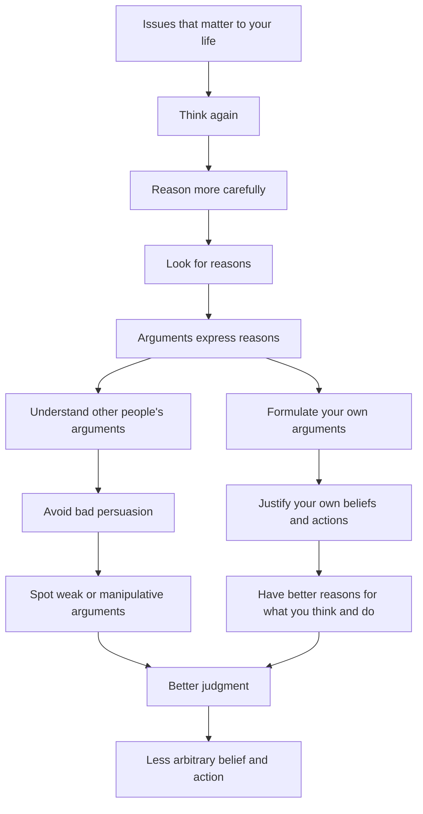
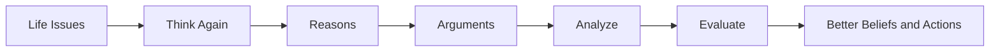

# 1. Why Arguments Matter

## 1. Core Ideas in Order of Appearance — 3 ideas

### Idea 1: The course is about learning to “think again”

**Plain-English Meaning:**
The course is not about memorizing the instructors’ opinions. It is about learning a better way to think about issues that matter to you.

**Why It Matters:**
Many important life decisions require careful reasoning, not impulse, habit, emotion, or social pressure.

**Common Confusion:**
Critical thinking is not the same as being argumentative or skeptical about everything. It means thinking more carefully and more deeply.

---

### Idea 2: The course focuses on reasoning and arguing

**Plain-English Meaning:**
Reasoning is the process of using reasons to support beliefs and actions. Arguments are the way those reasons are expressed.

**Why It Matters:**
If you can understand arguments, you can understand the reasons people are giving. If you can create good arguments, you can have better reasons for what you believe and do.

**Common Confusion:**
In everyday speech, “argument” often means a fight. In logic, an argument means a structured set of reasons offered in support of a conclusion.

---

### Idea 3: Learning arguments helps you avoid bad persuasion

**Plain-English Meaning:**
People may try to convince you using weak, emotional, misleading, or manipulative arguments.

**Why It Matters:**
You need to know when someone is giving you a good reason versus when they are merely trying to influence you.

**Examples from the lecture:**
A used car salesman may try to persuade you by saying you will look cool in the car. A lawyer may try to persuade a jury. An evangelist may try to change your religious beliefs. A friend may try to convince you to go on a cross-country trip.

**Common Confusion:**
A reason can sound appealing without being a good reason.

---

## 2. Definitions and Distinctions — 7 terms

### Term: Reasoning

**Definition:**
The process of using reasons to decide what to believe or do.

**In My Own Words:**
Reasoning is thinking with support. It is not just having an opinion; it is having grounds for that opinion.

**Contrast With:**
Arbitrary belief or action.

**Example:**
“I should not buy this car just because it looks cool. I should consider price, reliability, safety, and whether I need it.”

**Non-Example:**
“I’ll buy this car because I feel like it.”

**Documented Real-World Example:**
During Apollo 13, NASA ground controllers had to reason from evidence under pressure after an oxygen tank explosion. NASA describes how controllers identified the core question, “How to get back safely to Earth?”, computed new engine burns, tested new procedures in simulators, and used the lunar module as a lifeboat. This is reasoning because decisions were made from available facts, constraints, calculations, and tested procedures rather than impulse. [Source: NASA](https://www.nasa.gov/missions/apollo/apollo-13-mission-details/)


*Image: Apollo 13 Mission Control during the crisis. Source: NASA / Wikimedia Commons.*

---

### Term: Argument

**Definition:**
A way of expressing reasons in support of a belief, decision, or conclusion.

**In My Own Words:**
An argument is a reason-giving structure.

**Contrast With:**
A description, explanation, story, thank-you note, or emotional appeal.

**Example:**
“You should vote for this candidate because they have experience, sound policies, and a strong record.”

**Non-Example:**
“Thank you to everyone who volunteered at the event.”

**Documented Real-World Example:**
Martin Luther King Jr.’s “Letter from Birmingham Jail” is a documented argument, not merely an expression of feeling. King responds to critics by giving reasons for direct action and civil disobedience: unjust laws degrade human personality, segregation laws are unjust, and people have a moral responsibility to disobey unjust laws. [Source: Stanford King Institute](https://okra.stanford.edu/link/document630416-041)


*Image: Recreation of King’s Birmingham Jail cell at the National Civil Rights Museum. Source: Wikimedia Commons.*

---

### Term: Standard Form

**Definition:**
A structured way of laying out an argument so that its premises and conclusion are clear.

**In My Own Words:**
Standard form cleans up an argument and makes it easier to inspect.

**Contrast With:**
A messy paragraph where the reasons and conclusion are mixed together.

**Example Format:**

1. Premise
2. Premise
3. Therefore, conclusion

**Documented Real-World Example:**
One standard-form reconstruction of King’s argument in “Letter from Birmingham Jail” is: (1) Any law that degrades human personality is unjust. (2) Segregation statutes degrade human personality. (3) Therefore, segregation statutes are unjust. Putting the argument into this form makes the premises and conclusion easier to inspect. [Source: Stanford King Institute](https://okra.stanford.edu/link/document630416-041)


*Image: The Birmingham Jail setting helps situate the argument being reconstructed. Source: Wikimedia Commons.*

---

### Term: Suppressed Premise

**Definition:**
A missing or unstated premise that is needed for the argument to work.

**In My Own Words:**
It is something the speaker assumes but does not say out loud.

**Example:**
“You should buy this car because it looks cool.”

**Possible Suppressed Premise:**
If a car makes you look cool, then you should buy it.

**Common Confusion:**
People often think the argument only includes what is explicitly said. But many arguments depend on hidden assumptions.

**Documented Real-World Example:**
Before the 2003 Iraq invasion, analysts noted that some speeches placed 9/11, terrorism, and Saddam Hussein close together without always stating the explicit conclusion that Iraq was involved in 9/11. The audience could supply a suppressed premise such as “states associated with terrorism after 9/11 are part of the same threat.” That missing premise helped connect statements that were not always asserted directly. [Source: Windsor Studies in Argumentation](https://windsor.scholarsportal.info/omp/index.php/wsia/catalog/download/19/51/200?inline=1)


*Image: President George W. Bush announcing Operation Iraqi Freedom in 2003. Source: White House / Wikimedia Commons.*

---

### Term: Deductive Argument

**Definition:**
An argument that aims to be logically valid.

**In My Own Words:**
A deductive argument tries to make the conclusion follow necessarily from the premises.

**Contrast With:**
Inductive argument.

**Example:**
All humans are mortal.
Socrates is human.
Therefore, Socrates is mortal.

**Documented Real-World Example:**
Legal scholars often reconstruct judicial reasoning as a syllogism. In discussions of *Youngstown Sheet & Tube Co. v. Sawyer*, the argument can be stated deductively: (1) The President’s power to issue an order must come from Congress or the Constitution. (2) Neither Congress nor the Constitution authorized the steel-seizure order. (3) Therefore, the President lacked power to issue the order. If the premises are accepted, the conclusion follows by structure. [Source: AustLII Legal Education Digest](https://www.austlii.edu.au/au/journals/LegEdDig/2007/36.html)


*Image: United States Supreme Court Building, where Youngstown was decided. Source: Wikimedia Commons.*

---

### Term: Inductive Argument

**Definition:**
An argument that does not try to be deductively valid, but instead gives support that makes the conclusion more likely or reasonable.

**In My Own Words:**
Inductive reasoning deals with probability, patterns, explanations, analogies, and evidence.

**Contrast With:**
Deductive argument.

**Example:**
Most cars from this brand have been reliable, so this new model is probably reliable.

**Documented Real-World Example:**
John Snow’s 1854 cholera investigation is a classic real-world case of inductive reasoning. Snow mapped cholera deaths, noticed that many clustered around the Broad Street pump, compared households served by different water companies, and inferred that contaminated water was the likely source. The evidence made the conclusion strongly supported, though it was not a deductive certainty. [Source: National Library of Medicine](https://pmc.ncbi.nlm.nih.gov/articles/PMC7150208/)


*Image: John Snow’s cholera map showing cases clustered around water pumps. Source: Wikimedia Commons.*

---

### Term: Fallacy

**Definition:**
A common and tempting mistake in reasoning.

**In My Own Words:**
A fallacy is a reasoning trap.

**Examples Mentioned:**
Vagueness, ambiguity, irrelevance, ad hominem arguments, appeals to ignorance, and begging the question.

**Documented Real-World Example:**
The Federal Trade Commission’s 2016 “all natural” advertising cases show how fallacies and reasoning errors can matter outside classrooms. Consumers could be led by a vague positive phrase toward a conclusion about product purity, even when the products contained synthetic ingredients. The reasoning mistake is tempting because the label sounds meaningful before its exact meaning is tested. [Source: FTC](https://www.ftc.gov/news-events/news/press-releases/2016/04/four-companies-agree-stop-falsely-promoting-their-personal-care-products-all-natural-or-100-natural)


*Image: Sunscreen label using “All Natural” advertising language. Source: DailyMed / National Library of Medicine.*

---

## 3. Argument Structure — 3 examples

### Original Argument Example: Used Car Salesman

**Original Argument:**
“You should buy this car because it looks really cool, and you will look even cooler sitting in it.”

**Conclusion:**
You should buy this car.

**Premises:**

1. The car looks really cool.
2. You will look cooler sitting in the car.

**Hidden Assumptions:**

* Looking cool is an important reason to buy a car.
* This benefit outweighs other factors like price, safety, reliability, and need.

**Argument Type:**
Practical reasoning / persuasive argument.

**Strength Assessment:**
Weak unless the buyer’s main goal is appearance and the car also satisfies other important criteria.

**Improved Version:**
“You should consider buying this car if it fits your budget, is mechanically reliable, meets your transportation needs, and if appearance is important to you.”

---

### Original Argument Example: Lawyer in Court

**Original Argument:**
A lawyer tries to convince the jury that the defendant is guilty or not guilty.

**Conclusion:**
The defendant should be found guilty or not guilty.

**Premises:**
Depend on the evidence presented.

**Hidden Assumptions:**

* The evidence is reliable.
* The witnesses are credible.
* The legal standard has been met.

**Argument Type:**
Evidence-based legal argument.

**Strength Assessment:**
Depends on the quality of evidence and reasoning.

**Lesson:**
Serious decisions should not be made like flipping a coin. They require reasons.

---

### Original Argument Example: Friend Suggesting a Trip

**Original Argument:**
“Let’s go for a cross-country trip. It’ll be great.”

**Conclusion:**
We should go on a cross-country trip.

**Premises:**

1. The trip will be great.

**Hidden Assumptions:**

* If an experience will be great, we should do it.
* The costs, time, risks, and responsibilities are acceptable.

**Argument Type:**
Practical argument.

**Strength Assessment:**
Incomplete. More reasons are needed.

**Improved Version:**
“We should consider going on a cross-country trip because we have time, the cost is manageable, the route is interesting, and it would be meaningful for us.”

---

## 4. Argument Forms and Patterns — 1 pattern

This introductory lecture does not yet teach specific formal argument patterns like modus ponens or modus tollens. However, it introduces the general pattern of argument analysis.

### General Argument Pattern

**Pattern:**

1. Reason / Premise
2. Reason / Premise
3. Therefore, conclusion

**Valid or Invalid?:**
Depends on the structure and content of the argument.

**Plain-English Meaning:**
An argument gives support for a claim.

**Example:**
The car is reliable.
The car is affordable.
The car meets my needs.
Therefore, I should buy the car.

**How to Spot It:**
Look for conclusion indicators like “therefore,” “so,” “thus,” or “hence.”
Look for premise indicators like “because,” “since,” “given that,” or “for the reason that.”

**Common Trap:**
Mistaking persuasion for proof.

---

## 5. Fallacies and Reasoning Errors — 6 errors

The lecture previews fallacies that will be covered later.

### Fallacy / Error: Vagueness

**Definition:**
Using unclear or imprecise terms in an argument.

**Why It Fails:**
If the meaning is unclear, the reasoning becomes difficult to evaluate.

**Example:**
“This car is cool, so you should buy it.”

**Documented Real-World Example:**
In 2016, the Federal Trade Commission charged companies with falsely advertising personal-care products as “all natural” or “100% natural” even though the products contained synthetic ingredients. The phrase “natural” can sound reassuring while remaining unclear unless the seller specifies exactly what it excludes. The FTC’s California Naturel case documented a sunscreen advertised as “all natural” even though it contained dimethicone, a synthetic ingredient. [Source: FTC](https://www.ftc.gov/news-events/news/press-releases/2016/04/four-companies-agree-stop-falsely-promoting-their-personal-care-products-all-natural-or-100-natural)


*Image: Sunscreen label using “All Natural” advertising language. Source: DailyMed / National Library of Medicine.*

**Better Reasoning:**
Specify what “cool” means and explain why it matters.

**How I Might Fall for This:**
I may accept vague positive words like “great,” “smart,” “successful,” or “high quality” without asking what they specifically mean.

---

### Fallacy / Error: Ambiguity

**Definition:**
Using a word or phrase with more than one meaning.

**Why It Fails:**
The argument may shift meanings without the listener noticing.

**Example:**
Not fully developed in this lecture, but introduced as a major topic.

**Documented Real-World Example:**
During President Bill Clinton’s 1998 grand jury testimony, he famously said, “It depends on what the meaning of the word ‘is’ is.” He was distinguishing between “is” as present-tense only and “is” as including whether something had ever been true. The ambiguity mattered because the wording affected whether an earlier denial sounded false or technically defensible. [Source: Slate](https://slate.com/news-and-politics/1998/09/bill-clinton-and-the-meaning-of-is.html)


*Image: Ken Starr testifying during the Clinton impeachment inquiry. Source: Library of Congress / Wikimedia Commons.*

**Better Reasoning:**
Clarify the meaning of key terms.

**How I Might Fall for This:**
I may assume a word has one meaning when the speaker is using it in multiple ways.

---

### Fallacy / Error: Irrelevance

**Definition:**
Giving a reason that does not actually support the conclusion.

**Why It Fails:**
The reason may be emotionally powerful but logically disconnected.

**Example:**
“You should buy this car because you will look cool.”

**Documented Real-World Example:**
In *City of Chicago v. Sessions* (2018), the Seventh Circuit described one of the Attorney General’s arguments as “a red herring.” The case was about whether federal grant conditions could require local law enforcement to assist with federal immigration enforcement, but the government framed the issue as whether localities could “thwart federal law enforcement.” The court said that broader framing was irrelevant to the actual legal question before it. [Source: Cornell Wex](https://www.law.cornell.edu/wex/red_herring)


*Image: Dirksen Federal Building, home of the Seventh Circuit. Source: U.S. Government / Wikimedia Commons.*

**Better Reasoning:**
Ask whether the reason is actually relevant to the decision.

**How I Might Fall for This:**
I may be persuaded by status, confidence, charm, fear, or emotion instead of evidence.

---

### Fallacy / Error: Ad Hominem

**Definition:**
Attacking the person instead of addressing the argument.

**Why It Fails:**
A person’s character does not automatically prove their argument false.

**Example:**
The lecture mentions ad hominem as a fallacy to be studied later.

**Documented Real-World Example:**
In the 2004 Bush-Kerry presidential debates, John Kerry criticized the coalition strategy in Iraq. George W. Bush replied partly by saying that a candidate could not lead if he “denigrates the contributions” of allied soldiers. Argumentation scholars have used this exchange as an example of ad hominem because it shifted from Kerry’s claim about coalition strength to Kerry’s character and fitness to lead. [Source: Rozenberg Quarterly](https://rozenbergquarterly.com/issa-proceedings-2006-ad-hominem-argument-in-the-bushkerry-presidential-debates/)


*Image: Bush and Kerry campaign signs from the 2004 election. Source: Wikimedia Commons.*

**Better Reasoning:**
Evaluate the argument itself.

---

### Fallacy / Error: Appeal to Ignorance

**Definition:**
Arguing that something is true because it has not been proven false, or false because it has not been proven true.

**Why It Fails:**
Lack of evidence against a claim is not always evidence for it.

**Example:**
The lecture previews this as a later topic.

**Documented Real-World Example:**
During the McCarthy era, Senator Joseph McCarthy described one case by saying there was “nothing in the files to disprove” Communist connections. That treats a lack of disproof as if it were evidence of guilt. The problem is that not finding evidence against an accusation does not by itself prove the accusation true. 
 [Source: Fallacy Files](https://www.fallacyfiles.org/ignorant.html)

Video: [Joseph McCarthy's Downfall Was Accusing the Army of Communism](https://www.youtube.com/watch?v=14CTeElwq-A)


*Image: Senator Joseph McCarthy, ca. 1954. Source: National Archives / Wikimedia Commons.*

---

### Fallacy / Error: Begging the Question

**Definition:**
Assuming the very thing that the argument is supposed to prove.

**Why It Fails:**
The argument goes in a circle instead of giving independent support.

**Example:**
The lecture says this is a major fallacy people commit frequently.

**Documented Real-World Example:**
At a 2017 press conference, President Donald Trump said, “The news is fake because so much of the news is fake.” The reason repeats the conclusion in nearly the same words, so it does not give independent evidence that the specific news being discussed was false. [Source: Dakota Free Press quoting CNN transcript](https://dakotafreepress.com/2017/02/17/trump-begs-the-question-the-news-is-fake-because-so-much-of-the-news-is-fake/)


*Image: Donald Trump at a 2017 press conference. Source: Wikimedia Commons.*

---

## 6. Worked Examples — 2 examples

### Example 1: Letter to the Editor

**Example:**
Some letters to the editor contain arguments, while others do not.

**Question Being Asked:**
Does this passage contain an argument?

**Step 1 — Identify the Conclusion:**
If the letter tries to convince readers to believe or do something, it likely has a conclusion.

**Step 2 — Identify the Premises:**
Look for reasons offered in support of that conclusion.

**Step 3 — Identify the Logical Form:**
The argument may be political, practical, moral, or evidence-based.

**Step 4 — Test the Reasoning:**
Ask whether the reasons actually support the conclusion.

**Step 5 — Final Judgment:**
Not every passage is an argument. Some merely express thanks, describe events, or share feelings.

**Lesson Learned:**
Before evaluating an argument, first determine whether there is an argument at all.

---

### Example 2: Used Car Salesman

**Example:**
A salesman says you should buy a car because it looks cool and makes you look cool.

**Question Being Asked:**
Is this a good reason to buy the car?

**Step 1 — Identify the Conclusion:**
You should buy the car.

**Step 2 — Identify the Premises:**
The car looks cool.
You will look cool in it.

**Step 3 — Identify the Logical Form:**
Practical argument based on appearance/status.

**Step 4 — Test the Reasoning:**
Ask whether appearance is enough to justify buying a car.

**Step 5 — Final Judgment:**
The argument is weak unless appearance is the buyer’s main criterion and other practical concerns are satisfied.

**Lesson Learned:**
A reason may be psychologically persuasive without being logically strong.

---

## 7. Truth Tables, Symbols, and Formal Tools — 4 tools/concepts

This lecture does not yet introduce formal symbols or truth tables.

However, it previews that the course will later cover:

* Propositional logic
* Categorical logic
* Deductive validity
* Formal structure of arguments

**Mistake to Avoid:**
Do not jump into symbolic logic before understanding the basic structure of arguments: premises, conclusion, hidden assumptions, and purpose.

---

## 8. Critical Thinking Application — 4 applications

### Where This Applies: Personal Beliefs

**Bad Reasoning Version:**
“I believe this because someone persuasive told me.”

**Better Reasoning Version:**
“What reasons were given? Are they good reasons? Do they actually support the conclusion?”

**Decision Lesson:**
Do not outsource your beliefs to confident people.

---

### Where This Applies: Buying Decisions

**Bad Reasoning Version:**
“This product looks impressive, so I should buy it.”

**Better Reasoning Version:**
“What problem does this solve? What evidence supports the purchase? What are the tradeoffs?”

**Decision Lesson:**
Persuasion is not the same as justification.

---

### Where This Applies: Legal Judgment

**Bad Reasoning Version:**
“The lawyer sounded convincing, so the defendant must be guilty.”

**Better Reasoning Version:**
“What evidence was presented? Does it meet the required standard? Are there alternative explanations?”

**Decision Lesson:**
High-stakes decisions require careful argument evaluation.

---

### Where This Applies: Life Choices

**Bad Reasoning Version:**
“My friend says the trip will be great, so I should go.”

**Better Reasoning Version:**
“What are the reasons? What are the costs, risks, benefits, and alternatives?”

**Decision Lesson:**
Enthusiasm is not enough. Big commitments require reasons.

---

## 9. Quiz / Assignment / Exam Relevance — 3 likely tested concepts

### Likely Tested Concept: What is an argument?

**How They Might Ask It:**
They may give a passage and ask whether it contains an argument.

**What to Watch For:**
Does the passage offer reasons in support of a conclusion?

**My Rule of Thumb:**
No reasons + no conclusion = probably not an argument.

**Practice Question:**
“Thank you to everyone who helped clean the park yesterday.”
Is this an argument?

**Answer:**
No.

**Explanation:**
It expresses gratitude but does not offer reasons for a conclusion.

---

### Likely Tested Concept: Argument analysis

**How They Might Ask It:**
They may ask you to identify the conclusion, premises, or missing assumptions.

**What to Watch For:**
The conclusion may not appear at the end. The premises may be scattered throughout the passage.

**My Rule of Thumb:**
Ask: “What is the speaker trying to get me to believe or do?”

---

### Likely Tested Concept: Course structure

**How They Might Ask It:**
They may ask what the four parts of the course are.

**Answer:**

1. Analyze arguments
2. Deductive arguments
3. Inductive arguments
4. Fallacies

---

## 10. Watch Carefully For — 11 points

* Not every passage contains an argument.
* Arguments are expressions of reasons.
* The first task is to identify whether an argument is present.
* Then identify the conclusion and premises.
* Then put the argument into standard form.
* Then look for missing or suppressed premises.
* Deductive arguments aim at logical validity.
* Inductive arguments work differently from deductive arguments.
* Fallacies are common, tempting reasoning mistakes.
* Persuasive examples are not always good arguments.
* The course is not trying to tell you what to believe; it is trying to teach you how to reason better.

---

## 11. Big Picture Diagram — 1 diagram

The big-picture mental model is:

```text
Reasons → Arguments → Better Thinking → Better Decisions
```



This fits the lecture because Sinnott-Armstrong frames the whole course around learning to reason better by understanding arguments, since arguments are how reasons get expressed. He also emphasizes that this helps with both forming your own beliefs and avoiding bad arguments from others. 

### Ultra-Compact Version — 1 diagram

This is the version I would memorize:



### Hand-Drawn Version

```text
                 THINK AGAIN

        Issues that matter to your life
                    ↓
             Reason carefully
                    ↓
             Look for reasons
                    ↓
          Arguments express reasons
              /                 \
             /                   \
Understand others          Formulate your own
      ↓                           ↓
Avoid bad persuasion       Justify beliefs/actions
              \                 /
               \               /
                Better judgment
                    ↓
        Less arbitrary belief and action
```

### One-Line Memory Hook

**Arguments are the bridge between reasons and better judgment.**

---

## 12. Compressed Takeaways — 10 takeaways

1. The course is called **Think Again: How to Reason and Argue**.
2. Its purpose is to help students think more deeply about issues that matter to them.
3. Reasoning matters because most people do not want arbitrary or unjustified beliefs.
4. Arguments are ways of expressing reasons.
5. Understanding arguments helps us understand reasons.
6. Formulating good arguments helps us justify our own beliefs and actions.
7. Evaluating arguments helps us avoid manipulation by bad arguments.
8. The course has four parts: analysis, deduction, induction, and fallacies.
9. Argument analysis includes identifying arguments, extracting premises and conclusions, putting them in standard form, and supplying missing premises.
10. The course will also cover deductive logic, inductive reasoning, probability, decision making, and common fallacies.

---

## 13. One-Line Mental Model — 1 mental model

**This lecture is really about:**
Learning that good thinking begins by identifying, understanding, and evaluating the reasons behind beliefs and actions.