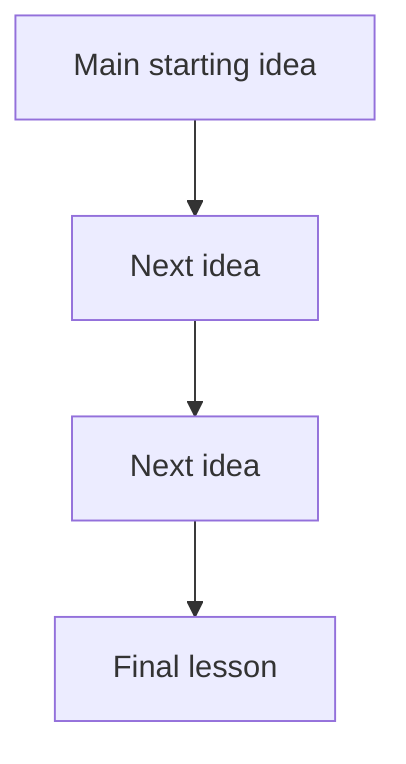

# Intro to Logic and Critical Thinking Specialization

## Notes format

````markdown
## Lecture Title

**Title:**  
**Course:** Duke University — Introduction to Logic and Critical Thinking / Think Again  
**Source:** Transcript  
**Main Theme:**  

---

## 1. Core Ideas in Order of Appearance — X ideas

### Idea 1:

**Plain-English Meaning:**  
**Why It Matters:**  
**Common Confusion:**  

### Idea 2:

**Plain-English Meaning:**  
**Why It Matters:**  
**Common Confusion:**  

---

## 2. Definitions and Distinctions — X terms

### Term 1:

**Definition:**  
**In My Own Words:**  
**Contrast With:**  
**Example:**  
**Non-Example:**  

### Term 2:

**Definition:**  
**In My Own Words:**  
**Contrast With:**  
**Example:**  
**Non-Example:**  

---

## 3. Argument Structure — X examples

### Original Argument Example 1:

**Original Argument:**  
**Conclusion:**  
**Premises:**  

1.  
2.  
3.  

**Hidden Assumptions:**  
**Argument Type:**  
**Strength Assessment:**  
**Improved Version:**  
**Lesson:**  

---

## 4. Argument Forms and Patterns — X patterns

### Pattern 1:

**Pattern:**  

1.  
2.  
3.  

**Valid or Invalid?:**  
**Plain-English Meaning:**  
**Example:**  
**How to Spot It:**  
**Common Trap:**  

---

## 5. Fallacies and Reasoning Errors — X errors

### Fallacy / Error 1:

**Definition:**  
**Why It Fails:**  
**Example:**  
**Better Reasoning:**  
**How I Might Fall for This:**  

---

## 6. Worked Examples — X examples

### Example 1:

**Example:**  
**Question Being Asked:**  
**Step 1 — Identify the Conclusion:**  
**Step 2 — Identify the Premises:**  
**Step 3 — Identify the Logical Form:**  
**Step 4 — Test the Reasoning:**  
**Step 5 — Final Judgment:**  
**Lesson Learned:**  

---

## 7. Truth Tables, Symbols, and Formal Tools — X tools/concepts

### Tool / Concept 1:

**Symbol / Tool:**  
**Meaning:**  
**Plain-English Translation:**  
**Formal Rule:**  
**Example:**  
**Mistake to Avoid:**  

---

## 8. Critical Thinking Application — X applications

### Where This Applies 1:

**Bad Reasoning Version:**  
**Better Reasoning Version:**  
**Decision Lesson:**  

---

## 9. Quiz / Assignment / Exam Relevance — X likely tested concepts

### Likely Tested Concept 1:

**How They Might Ask It:**  
**What to Watch For:**  
**My Rule of Thumb:**  
**Practice Question:**  
**Answer:**  
**Explanation:**  

---

## 10. Watch Carefully For — X points

- 
- 
- 

---

## 11. Big Picture Diagram — 1 diagram



**Diagram Meaning:**

**Memory Hook:**

---

## 12. Compressed Takeaways — X takeaways

1.
2.
3.
4.
5.

---

## 13. One-Line Mental Model — 1 mental model

**This lecture is really about:**

````

## Short Version

```text
Lecture Title
→ Core Ideas
→ Definitions and Distinctions
→ Argument Structure
→ Argument Forms and Patterns
→ Fallacies and Reasoning Errors
→ Worked Examples
→ Truth Tables, Symbols, and Formal Tools
→ Critical Thinking Application
→ Quiz / Assignment / Exam Relevance
→ Watch Carefully For
→ Big Picture Diagram
→ Compressed Takeaways
→ One-Line Mental Model
````
