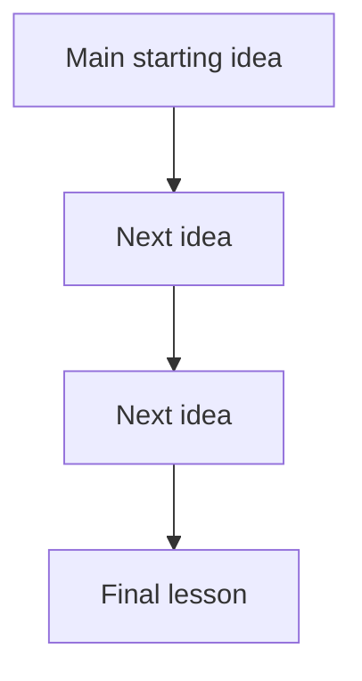
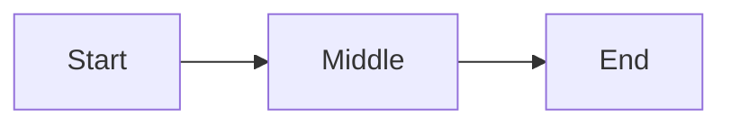

# Intro to Logic and Critical Thinking Specialization

## Notes format 

````markdown
# Lecture Number. Lecture Title

## 1. Core Ideas in Order of Appearance — X ideas

### Idea 1:

**Plain-English Meaning:**

**Why It Matters:**

**Examples from the lecture:**

**Common Confusion:**

---

### Idea 2:

**Plain-English Meaning:**

**Why It Matters:**

**Examples from the lecture:**

**Common Confusion:**

---

## 2. Definitions and Distinctions — X terms

### Term:

**Definition:**

**In My Own Words:**

**Contrast With:**

**Example:**

**Non-Example:**

**Documented Real-World Example:**

[Source: Source Name](URL)

Video: [Video Title](URL)


*Image: Image caption. Source: Image source.*

---

## 3. Argument Structure — X examples

### Original Argument Example:

**Original Argument:**

**Conclusion:**

**Premises:**

1.
2.
3.

**Hidden Assumptions:**

*
*

**Argument Type:**

**Strength Assessment:**

**Improved Version:**

**Lesson:**

---

## 4. Argument Forms and Patterns — X patterns

### Pattern:

**Pattern:**

1.
2.
3.

**Valid or Invalid?:**

**Plain-English Meaning:**

**Example:**

**How to Spot It:**

**Common Trap:**

---

## 5. Fallacies and Reasoning Errors — X errors

### Fallacy / Error:

**Definition:**

**Why It Fails:**

**Example:**

**Documented Real-World Example:**

[Source: Source Name](URL)

Video: [Video Title](URL)


*Image: Image caption. Source: Image source.*

**Better Reasoning:**

**How I Might Fall for This:**

**One-line lesson:**

---

## 6. Worked Examples — X examples

### Example 1:

**Example:**

**Question Being Asked:**

**Step 1 — Identify the Conclusion:**

**Step 2 — Identify the Premises:**

**Step 3 — Identify the Logical Form:**

**Step 4 — Test the Reasoning:**

**Step 5 — Final Judgment:**

**Lesson Learned:**

---

## 7. Truth Tables, Symbols, and Formal Tools — X tools/concepts

### Tool / Concept:

**Symbol / Tool:**

**Meaning:**

**Plain-English Translation:**

**Formal Rule:**

**Example:**

**Mistake to Avoid:**

---

## 8. Critical Thinking Application — X applications

### Where This Applies:

**Bad Reasoning Version:**

**Better Reasoning Version:**

**Decision Lesson:**

---

## 9. Quiz / Assignment / Exam Relevance — X likely tested concepts

### Likely Tested Concept:

**How They Might Ask It:**

**What to Watch For:**

**My Rule of Thumb:**

**Practice Question:**

**Answer:**

**Explanation:**

---

## 10. Watch Carefully For — X points

*
*
*

---

## 11. Big Picture Diagram — 1 diagram

The big-picture mental model is:

```text
Core idea → Next idea → Next idea → Final lesson
```



This fits the lecture because:

### Ultra-Compact Version — 1 diagram



### Hand-Drawn Version

```text
                 LECTURE THEME

        Starting idea
              ↓
        Main reasoning step
              ↓
        Key distinction
              ↓
        Final lesson
```

### One-Line Memory Hook

**Memory hook goes here.**

---

## 12. Compressed Takeaways — X takeaways

1.
2.
3.
4.
5.

---

## 13. One-Line Mental Model — 1 mental model

**This lecture is really about:**

---

## Short Version

Lecture Title
→ Core Ideas
→ Definitions and Distinctions
→ Argument Structure
→ Argument Forms and Patterns
→ Fallacies and Reasoning Errors
→ Worked Examples
→ Truth Tables, Symbols, and Formal Tools
→ Critical Thinking Application
→ Quiz / Assignment / Exam Relevance
→ Watch Carefully For
→ Big Picture Diagram
→ Compressed Takeaways
→ One-Line Mental Model

---

## Important Formatting Rules

1. Use `##` as the top-level heading inside the notes body.
2. Include item counts in every major section heading.
3. Use `###` for individual ideas, terms, examples, fallacies, applications, and quiz concepts.
4. Add documented real-world examples where useful.
5. Include source links for documented examples.
6. Include video links when they improve memory.
7. Include images with captions when they make the concept easier to remember.
8. Add a one-line lesson for fallacies.
9. Add three diagram forms when useful:
   - Main Mermaid diagram
   - Ultra-compact Mermaid diagram
   - Hand-drawn text version
10. End with compressed takeaways and a one-line mental model.
````
