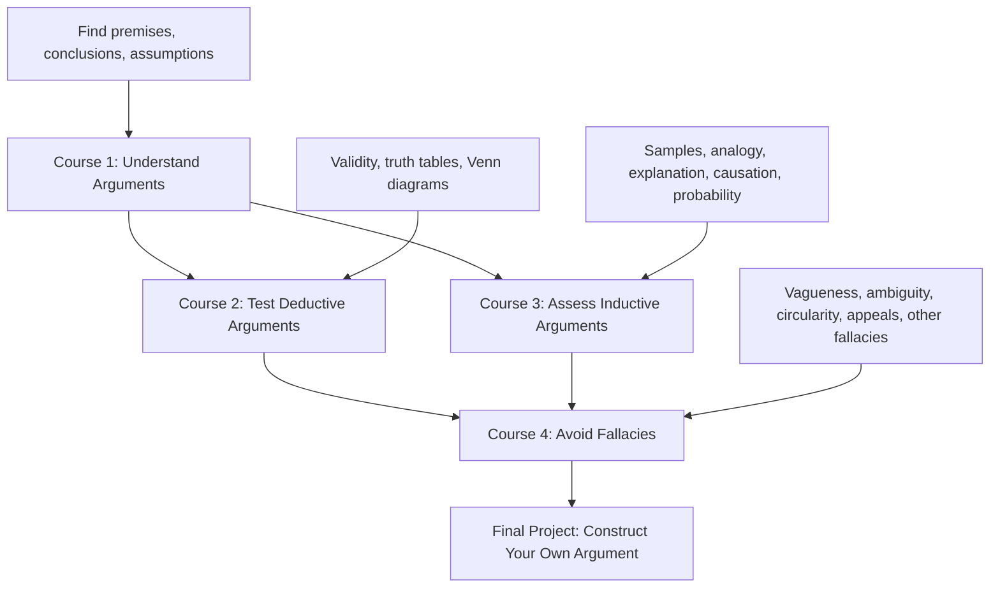
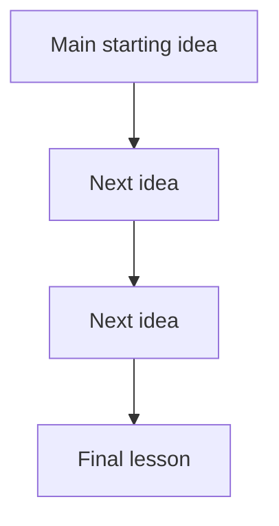
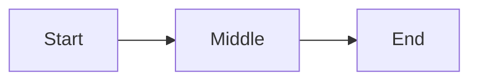

# Intro to Logic and Critical Thinking Specialization

## Metalearning Map for Duke’s “Introduction to Logic and Critical Thinking”

### Table of Contents

1. [The destination](#1-the-destination)
2. [Why you are learning this](#2-why-you-are-learning-this)
3. [What you need to learn](#3-what-you-need-to-learn)
4. [The course map](#4-the-course-map)
5. [Concepts, facts, and procedures](#5-concepts-facts-and-procedures)
6. [Likely bottlenecks](#6-likely-bottlenecks)
7. [How to learn this course effectively](#7-how-to-learn-this-course-effectively)
8. [The 10% metalearning plan](#8-the-10-metalearning-plan)
9. [Your final output](#9-your-final-output)

---

## 1. The destination

The goal is **not** merely to finish the Coursera specialization.

The real goal is:

> To become the kind of person who can identify, analyze, evaluate, and construct arguments clearly.

That matches the specialization’s stated purpose: improving your ability to identify, analyze, and evaluate arguments from others, and construct arguments of your own. Coursera also says the specialization teaches you how to recognize when an argument is being given, identify its crucial parts, uncover implicit assumptions, apply deductive and inductive standards, and detect fallacies. ([Coursera][1])

So your destination is practical reasoning power.

Not “I know fallacy names.”

But:

> “I can look at a claim, break it apart, test it, and decide whether I should believe it.”

---

## 2. Why you are learning this

This course is both **instrumental** and **intrinsic**.

### Instrumental reason

You want this because it improves your ability to think, argue, invest, study, write, evaluate claims, and avoid being fooled.

For you specifically, it connects strongly to:

* investing decisions
* systems thinking
* statistics and probability
* communication and persuasion
* leadership
* product thinking
* philosophical reading
* detecting weak reasoning in yourself and others

This is an unusually high-leverage course because it improves the **quality of your judgment**, not just your knowledge of one subject.

### Intrinsic reason

There is also a pure intellectual reason:

> Logic is the grammar of clear thought.

You are not only learning “content.” You are learning how thought itself can be inspected.

---

## 3. What you need to learn

Using the metalearning framework, divide the course into:

1. **Concepts** — ideas to understand flexibly
2. **Facts** — things to remember
3. **Procedures** — things to practice until they become automatic

This course is mostly a **procedure-heavy thinking course**.

That is important.

You cannot master it by watching videos and recognizing terms. You master it by repeatedly doing operations on arguments.

---

## 4. The course map

The specialization has **4 courses** and an optional final project. Coursera lists it as beginner level, with no prior experience required, and recommends taking the courses in order from 1 to 4. It is estimated at about 5 months at 4 hours per week. ([Coursera][1])

The four courses are:

| Course                                     |                             Core job | Coursera estimate |
| ------------------------------------------ | -----------------------------------: | ----------------: |
| Think Again I: How to Understand Arguments | Understand and reconstruct arguments |          26 hours |
| Think Again II: How to Reason Deductively  |              Test deductive validity |          13 hours |
| Think Again III: How to Reason Inductively |           Assess inductive arguments |          24 hours |
| Think Again IV: How to Avoid Fallacies     |           Detect defective reasoning |          18 hours |

The final project asks you to construct your own argument on a topic that interests you, with a thesis statement and a 400–600 word supporting argument. ([Coursera][1])

The hidden structure is this:



Course 1 is the foundation. Do not rush it.

If Course 1 is weak, everything else becomes name-memorization.

---

## 5. Concepts, facts, and procedures

### 5.1 Concepts

These are the ideas you need to understand deeply and flexibly.

#### Argument

You need to understand what an argument is, when someone is giving one, and when they are merely explaining, describing, asserting, complaining, or storytelling.

Course 1 explicitly focuses on learning what an argument is, how to identify arguments, break them into essential parts, arrange them to show their connections, and add suppressed premises. ([Coursera][1])

#### Premise and conclusion

You need to see the skeleton:

> “Because of these reasons, therefore this claim.”

#### Suppressed premise

This is one of the most important ideas in the whole course.

People rarely state every assumption. Good critical thinking often means asking:

> “What must be true for this argument to work?”

#### Deductive validity

Deductive reasoning asks:

> “If the premises were true, would the conclusion have to be true?”

Course 2 focuses on validity, truth tables, and Venn diagrams for determining whether an argument is deductively valid. ([Coursera][1])

#### Inductive strength

Inductive reasoning asks:

> “Given these premises, how strongly should I believe the conclusion?”

Course 3 covers five common forms of inductive argument: generalizations from samples, applications of generalizations, inference to the best explanation, arguments from analogy, and causal reasoning. It also introduces probability for decision-making. ([Coursera][1])

#### Fallacy

A fallacy is not just “a bad argument.”

More precisely, it is a recurring defect in reasoning that makes an argument unreliable, misleading, or weak.

Course 4 describes fallacies as arguments with common but avoidable defects such as equivocation, circularity, and vagueness. ([Coursera][1])

---

### 5.2 Facts

These are things you should memorize.

Not because memorization is the final goal, but because the facts become handles for thinking.

Memorize:

* definition of argument
* definition of premise
* definition of conclusion
* common premise indicators: because, since, given that, for
* common conclusion indicators: therefore, thus, hence, so
* deductive validity
* soundness
* inductive strength
* cogency
* suppressed premise
* truth-table rules
* Venn diagram conventions
* names and definitions of major fallacies
* the five inductive argument forms
* difference between ambiguity and vagueness
* difference between deductive and inductive standards

Your rule should be:

> Memorize the vocabulary just enough that it helps you perform the procedures.

Do not become a collector of terms.

---

### 5.3 Procedures

These are the real skills.

You should practice them repeatedly.

#### Procedure 1: Identify whether there is an argument

Ask:

1. Is someone trying to prove something?
2. What is the conclusion?
3. What reasons are offered?
4. Is this an argument, explanation, report, warning, or emotional expression?

#### Procedure 2: Reconstruct the argument

Take messy natural language and turn it into a clean structure:

```text
Premise 1:
Premise 2:
Suppressed Premise:
Conclusion:
```

This is the backbone skill.

#### Procedure 3: Add suppressed premises

Ask:

> What unstated belief connects the stated premises to the conclusion?

Example:

```text
Claim: You should not invest in that company because it has no profits.

Premise 1: The company has no profits.
Suppressed Premise: Companies with no profits are poor investments.
Conclusion: You should not invest in that company.
```

Then you can inspect the hidden premise.

Maybe it is true. Maybe it is false. Maybe it is too broad.

#### Procedure 4: Test deductive validity

For deductive arguments, ask:

> Is it possible for the premises to be true and the conclusion false?

If yes, invalid.

If no, valid.

#### Procedure 5: Assess inductive strength

For inductive arguments, ask:

> How much support do these premises give the conclusion?

Then inspect sample size, representativeness, analogy quality, causal mechanisms, alternative explanations, and base rates.

#### Procedure 6: Diagnose fallacies

Do not merely label the fallacy.

Use this format:

```text
Fallacy:
Why it is fallacious:
What assumption makes it tempting:
How to repair the argument:
```

That last line matters.

The goal is not to “win arguments.” The goal is to improve reasoning.

---

## 6. Likely bottlenecks

Here is where you should expect difficulty.

### Bottleneck 1: Confusing argument with explanation

This is subtle.

An explanation tells you why something happened.

An argument tries to prove that something is true.

Same word, different job.

### Bottleneck 2: Hidden assumptions

Most real arguments are incomplete.

The skill is not just seeing what was said. It is seeing what was **silently required**.

### Bottleneck 3: Validity vs truth

This is a classic beginner trap.

An argument can be valid even if its premises are false.

Validity is about structure.

Truth is about content.

### Bottleneck 4: Inductive reasoning feels less clean

Deductive reasoning has sharper answers.

Inductive reasoning lives in probability, uncertainty, strength, weakness, representativeness, causal inference, and judgment.

This will matter a lot for investing, statistics, business, and real-world decision-making.

### Bottleneck 5: Fallacy-name addiction

It is easy to memorize fallacy names and feel smart.

But the deeper skill is explaining:

> “What exactly went wrong in the reasoning?”

Fallacy names are labels. Diagnosis is the skill.

---

## 7. How to learn this course effectively

### 7.1 Do not watch passively

For every video, produce one of these:

```text
Definition:
Example:
Non-example:
My own example:
Common mistake:
```

This forces understanding.

### 7.2 Build an argument notebook

For each topic, write examples from:

* investing
* politics
* sales
* health advice
* workplace communication
* YouTube videos
* readings
* your own past beliefs

The course becomes powerful when you apply it to real claims you actually care about.

### 7.3 Use “recall on paper”

Since you care about memorization and exact recall, use this:

After each lesson, close the material and write:

```text
What was the main idea?
What are the key terms?
What procedure did I learn?
Can I reproduce the example?
Can I create my own example?
Where could I use this in real life?
```

Then compare against the lesson.

### 7.4 Practice argument reconstruction daily

Take one paragraph per day from something you read and reconstruct it.

Use this template:

```text
Original claim:

Conclusion:

Stated premises:

Suppressed premises:

Argument type:
Deductive / Inductive / Neither

Assessment:

Possible fallacy:

Improved version:
```

This is the single best practice.

### 7.5 Use quizzes as feedback, not judgment

Coursera says the courses include short ungraded quizzes after segments and a longer graded quiz at the end of each course. ([Coursera][1])

Use the short quizzes as diagnostic tools.

When you miss one, classify the miss:

```text
Miss type:
1. Did not know the definition
2. Misread the argument
3. Missed suppressed premise
4. Confused deductive vs inductive
5. Applied wrong procedure
6. Rushed
```

That turns mistakes into a learning system.

---

## 8. The 10% metalearning plan

Before going deep, spend a small amount of time mapping the course.

Because the specialization is roughly an 80-hour project, a strict 10% rule would allow around 8 hours of planning. But I would not spend that much upfront.

For this course, do this instead:

### Initial metalearning: 2–3 hours

Use that time to:

1. Skim all four course descriptions.
2. Look at the weekly module titles inside Coursera.
3. Create a one-page map of the specialization.
4. Open the final project instructions early.
5. Find 3–5 real-world argument sources you will analyze throughout the course.
6. Decide your note-taking template.
7. Decide your weekly practice rhythm.

Then start.

### Ongoing metalearning: 20 minutes weekly

At the end of each week, ask:

```text
What am I getting better at?
What am I still confusing?
Which procedure needs more reps?
Am I collecting terms or improving judgment?
What kind of real-world arguments should I practice on next?
```

This prevents both under-planning and analysis paralysis.

---

## 9. Your final output

Your goal should be to finish the specialization with a personal artifact, not just a certificate.

Create a document called:

> **My Field Guide to Reasoning Clearly**

Structure it like this:

```text
1. What is an argument?
2. How to reconstruct arguments
3. How to find hidden assumptions
4. How to test deductive arguments
5. How to assess inductive arguments
6. How to detect fallacies
7. Common reasoning mistakes I make
8. Real-world examples
9. My checklist for evaluating claims
10. My final argument essay
```

The final project already asks you to write a 400–600 word argument on a topic that interests you. ([Coursera][1])

Use that as your capstone, but go beyond it.

By the end, you should have a reusable thinking tool.

## The shortest version

Your metalearning map is:

```text
Why:
To improve judgment, argument quality, investing reasoning, communication, and intellectual self-defense.

What:
Concepts = argument, premise, conclusion, validity, induction, fallacy.
Facts = definitions, indicators, fallacy names, truth-table rules, inductive forms.
Procedures = reconstruct, test, evaluate, diagnose, repair.

How:
Do not passively watch. Reconstruct real arguments daily. Use recall on paper. Treat quizzes as feedback. Build a personal reasoning field guide.

Main bottleneck:
Not memorizing terms, but applying the right reasoning procedure to messy real-world arguments.

Final goal:
Become someone who can look at any claim and ask:
“What is being argued, what is assumed, and does the reasoning actually work?”
```

[1]: https://www.coursera.org/specializations/logic-critical-thinking-duke "Introduction to Logic and Critical Thinking | Coursera"


## Notes format 

````markdown
# Lecture Number. Lecture Title

## 1. Core Ideas in Order of Appearance — X ideas

### Idea 1:

**Plain-English Meaning:**

**Why It Matters:**

**Examples from the lecture:**

**Common Confusion:**

---

### Idea 2:

**Plain-English Meaning:**

**Why It Matters:**

**Examples from the lecture:**

**Common Confusion:**

---

## 2. Definitions and Distinctions — X terms

### Term:

**Definition:**

**In My Own Words:**

**Contrast With:**

**Example:**

**Non-Example:**

**Documented Real-World Example:**

[Source: Source Name](URL)

Video: [Video Title](URL)


*Image: Image caption. Source: Image source.*

---

## 3. Argument Structure — X examples

### Original Argument Example:

**Original Argument:**

**Conclusion:**

**Premises:**

1.
2.
3.

**Hidden Assumptions:**

*
*

**Argument Type:**

**Strength Assessment:**

**Improved Version:**

**Lesson:**

---

## 4. Argument Forms and Patterns — X patterns

### Pattern:

**Pattern:**

1.
2.
3.

**Valid or Invalid?:**

**Plain-English Meaning:**

**Example:**

**How to Spot It:**

**Common Trap:**

---

## 5. Fallacies and Reasoning Errors — X errors

### Fallacy / Error:

**Definition:**

**Why It Fails:**

**Example:**

**Documented Real-World Example:**

[Source: Source Name](URL)

Video: [Video Title](URL)


*Image: Image caption. Source: Image source.*

**Better Reasoning:**

**How I Might Fall for This:**

**One-line lesson:**

---

## 6. Worked Examples — X examples

### Example 1:

**Example:**

**Question Being Asked:**

**Step 1 — Identify the Conclusion:**

**Step 2 — Identify the Premises:**

**Step 3 — Identify the Logical Form:**

**Step 4 — Test the Reasoning:**

**Step 5 — Final Judgment:**

**Lesson Learned:**

---

## 7. Truth Tables, Symbols, and Formal Tools — X tools/concepts

### Tool / Concept:

**Symbol / Tool:**

**Meaning:**

**Plain-English Translation:**

**Formal Rule:**

**Example:**

**Mistake to Avoid:**

---

## 8. Critical Thinking Application — X applications

### Where This Applies:

**Bad Reasoning Version:**

**Better Reasoning Version:**

**Decision Lesson:**

---

## 9. Quiz / Assignment / Exam Relevance — X likely tested concepts

### Likely Tested Concept:

**How They Might Ask It:**

**What to Watch For:**

**My Rule of Thumb:**

**Practice Question:**

**Answer:**

**Explanation:**

---

## 10. Watch Carefully For — X points

*
*
*

---

## 11. Big Picture Diagram — 1 diagram

The big-picture mental model is:

```text
Core idea → Next idea → Next idea → Final lesson
```



This fits the lecture because:

### Ultra-Compact Version — 1 diagram



### Hand-Drawn Version

```text
                 LECTURE THEME

        Starting idea
              ↓
        Main reasoning step
              ↓
        Key distinction
              ↓
        Final lesson
```

### One-Line Memory Hook

**Memory hook goes here.**

---

## 12. Compressed Takeaways — X takeaways

1.
2.
3.
4.
5.

---

## 13. One-Line Mental Model — 1 mental model

**This lecture is really about:**

---

## Short Version

Lecture Title
→ Core Ideas
→ Definitions and Distinctions
→ Argument Structure
→ Argument Forms and Patterns
→ Fallacies and Reasoning Errors
→ Worked Examples
→ Truth Tables, Symbols, and Formal Tools
→ Critical Thinking Application
→ Quiz / Assignment / Exam Relevance
→ Watch Carefully For
→ Big Picture Diagram
→ Compressed Takeaways
→ One-Line Mental Model

---

## Important Formatting Rules

1. Use `##` as the top-level heading inside the notes body.
2. Include item counts in every major section heading.
3. Use `###` for individual ideas, terms, examples, fallacies, applications, and quiz concepts.
4. Add documented real-world examples where useful.
5. Include source links for documented examples.
6. Include video links when they improve memory.
7. Include images with captions when they make the concept easier to remember.
8. Add a one-line lesson for fallacies.
9. Add three diagram forms when useful:
   - Main Mermaid diagram
   - Ultra-compact Mermaid diagram
   - Hand-drawn text version
10. End with compressed takeaways and a one-line mental model.
````
